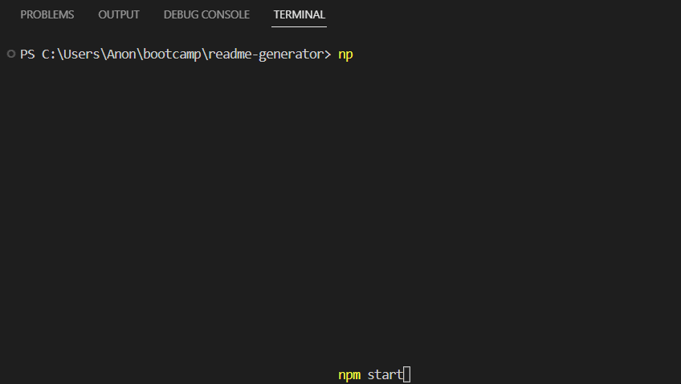

  ##README GENERATOR

  ## TABLE OF CONTENTS
- [License](#license)
- [Description](#description)
- [Installation](#installation)
- [Usage](#usage)
- [Contributors](#contributors)
- [Tests](#tests)
- [Contact](#contact)

  ## LICENSE
  MIT

  ## DESCRIPTION
  generate readme through Inquirer

  ## INSTALLATION
  install inquirer

  ## USAGE
  * 'npm start' in react terminal

  * 
  
  ## CONTRIBUTORS
  Lukas-h, "Markdown License Badges for your Project", Github

  ## TESTS
  na

  ## CONTACT
  * na
  * https://github.com/aramedis
  