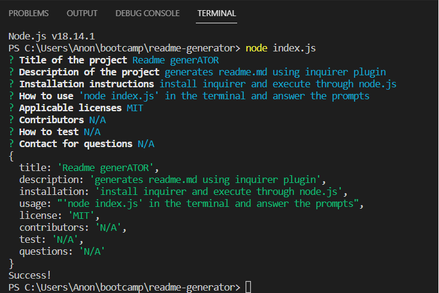

# readme-generator

## TABLE OF CONTENTS
- [Description](#description)
- [Installation](#installation)
- [Usage](#usage)
- [License](#license)
- [Contributors](#contributors)
- [Tests](#tests)
- [Contact](#contact)

## Description
generates readme.md using inquirer plugin

## INSTALLATION
install inquirer and execute through node.js

## USAGE
  'node index.js' in the terminal and answer the prompts

## LICENSE
  MIT

## CONTRIBUTORS
  N/A

## TESTS
  N/A

## CONTACT
  N/A
  

